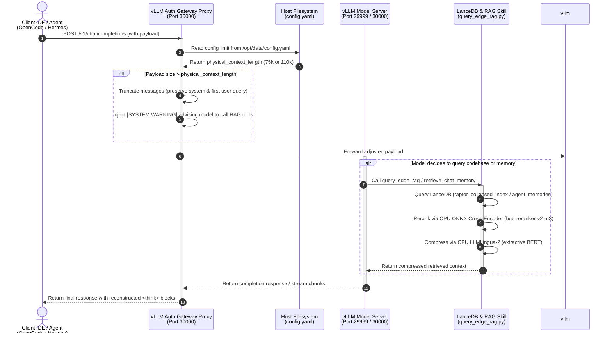
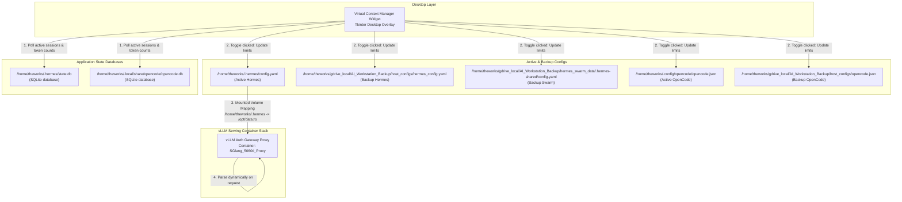

# Version 1.0 System Architecture and Configuration Documentation
## MCP RAG Outlook v2 Repository

This document details the system architecture, component configurations, retrieval-augmented generation (RAG) pipeline, and performance characteristics of the Multi-Agent RAG system calibrated for the AI Workstation stack.

---

## 1. System Topology & Data Flow Diagrams

The following diagrams illustrate the end-to-end data flows and network routing between the workstation clients, the desktop context manager widget, the authentication gateway proxy, and the backend model serving engine.

### Sequence Diagram: Client Request Interception & Prompt Compression



### Component Interaction: Desktop Context Manager Widget



---

## 2. Core Components and Parameters

### 2.1 vLLM Engine Configuration (Option A)
The model server is calibrated under **Option A** to maximize physical execution length while avoiding out-of-memory (OOM) states under GPU parallel workloads.

*   **Served Model:** `nvidia/Qwen3.6-35B-A3B-NVFP4` (hybrid MoE model post-training quantized to 4-bit).
*   **Tensor Parallel Size:** `--tensor-parallel-size 2` (sharded across dual RTX 5060 Ti GPUs).
*   **KV Cache Precision:** `--kv-cache-dtype fp8` (reduces memory consumption per token by 50%).
*   **Max Model Len:** `--max-model-len 112000` (physical ceiling of 112,000 tokens).
*   **Max Num Seqs:** `--max-num-seqs 4` (concurrency constraint limiting active decoding to 4 sequences).
*   **GPU Memory Utilization:** `--gpu-memory-utilization 0.97` (allows full allocation of VRAM).
*   **Attention Backend:** `--attention-backend flashinfer`.
*   **Prefix Caching:** `--enable-prefix-caching` (caches system instructions, tools, and preceding turns).
*   **Prefill Strategy:** `--enable-chunked-prefill` (chunked token processing preventing latency spikes).

### 2.2 vLLM Auth Gateway Proxy
The proxy acts as a reverse proxy on host port `30000`, intercepting completion requests to secure the endpoint and dynamically manage context lengths.

*   **Auth Token Security:** Validates requests using the `Authorization: Bearer <token>` header (bypass granted for local private IPs).
*   **Dynamic Limits:** Reads the `/opt/data/config.yaml` file dynamically on every request. This file parses `physical_context_length` from the active Hermes config.
*   **Context Slicing:** When the incoming payload exceeds the limit, the proxy truncates older messages but preserves critical system instructions, tools, and the very first user query.
*   **Truncation Alert Injection:** Injecting the following warning in the last user message to instruct the model to trigger RAG instead of hallucinating:
    > `[SYSTEM WARNING]: The older conversation history has been truncated from your active memory to maintain performance. If you require details regarding previous code milestones, authentication tokens, database connection credentials, or architectural design decisions that are not visible in the recent messages above, you MUST call the 'retrieve_chat_memory' tool to search the database. Do not attempt to guess or invent these details.`
*   **Reasoning Reassembly:** Re-constructs reasoning tokens in `<think>...</think>` tags for clients that do not support raw reasoning field streaming.

### 2.3 Virtual Context Manager Widget
A frameless desktop overlay widget implemented in python (Tkinter) that provides real-time tracking and control over the workstation's context state.

*   **Session Polling:** Runs a background thread polling active session token counts from the SQLite databases of Hermes (`~/.hermes/state.db`) and OpenCode (`~/.local/share/opencode/opencode.db`).
*   **Visual Status:** Displays active panels representing current conversations, tracking physical context usage (with color-coded limits) and virtual RAG context size.
*   **Fast/Huge Toggle Button:** A styled button mapped to the Catppuccin Mocha theme (Green `#a6e3a1` for Fast, Mauve `#cba6f7` for Huge) that updates configurations on click.
*   **Configuration Sync:** On click, the widget programmatically writes limits to three YAML configurations (Hermes active, Hermes backup, Swarm shared backup) and two JSON configurations (OpenCode active, OpenCode backup).

---

## 3. RAG Pipeline & Mathematical Limits

### 3.1 Pipeline Mechanics
Retrieval-Augmented Generation processes retrieved codebase and memory data via a tiered system:

1.  **LanceDB Vector Database:** In-process columnar database storing Arrow records. Flat L2 index search is utilized to prevent recall degradation on local code repos. BGE instruction prefixing is applied to queries.
2.  **CPU ONNX Cross-Encoder Reranker:** Reranks candidate chunks using `BAAI/bge-reranker-v2-m3` compiled to INT8 ONNX, capped to `ORT_SEQUENTIAL` with 2 execution threads to avoid CPU thrashing.
3.  **AST-Guided Code Compactor:** Parses Python code into AST trees, replacing function and class method bodies with `pass` statements, and C++/Java function bodies with `{ /* bypassed */ }` signatures. This extracts structural skeletons while reducing token footprints by up to 80%.
4.  **Extractive Prompt Compressor:** For remaining contexts, `LLMLingua-2` (BERT-based meetingbank compressor) compresses prompts down to the target budget (compression rate `0.33` to `0.50`), while bypassing compression for payloads under 2500 tokens.

### 3.2 Logarithmic Virtual Context Math
The relationship between the physical VRAM context ceiling ($P$) and the virtual codebase context limit ($V$) is defined by a logarithmic retrieval decay formula:

$$P = 24,000 + \frac{9,900}{0.85 - 0.06 \log_{10}(V)}$$

This formula calculates how much virtual database context ($V$) can be effectively indexed without causing recall degradation beyond prompt window capabilities. Solving for the two limits:

*   **Fast Mode ($P = 75,000$ tokens):**
    $$V_{\text{fast}} = 10^{10.58} \approx \mathbf{37,992,307,469 \text{ tokens (38 Billion)}} $$
*   **Huge Mode ($P = 110,000$ tokens):**
    $$V_{\text{huge}} = 10^{12.248} \approx \mathbf{1,770,390,929,483 \text{ tokens (1.77 Trillion)}} $$

---

## 4. Performance & Scheduling Cache Cliff Analysis

### The 75k Performance Cliff
During concurrency testing of 4 parallel agent workloads at different token limits, a severe performance cliff was observed at **75,000 tokens**:

```
Throughput (TPS)
  ▲
  │   ┌──────────────────┐  <- 306.79 TPS (Parallel prefill & decode active)
  │   │                  │
  │   │   Parallel Mode  │
  │   │    (50k - 75k)   │
  │   │                  │
  ├─ ─┴─ ─ ─ ─ ─ ─ ─ ─ ─ ┼ ─ ─ ─ ─ ─ ─ ─ ─ ┐   <- 75k Scheduling Cliff
  │                                        │
  │                                        │   Serial Queueing Mode (80k - 110k)
  │                                        │   (Only 1 agent served at a time)
  │                                        │
  │                                        └──────────► 32.71 TPS (At 110k)
  └──────────────────────────────────────────────────► Context size
```

*   **Under 75,000 Tokens:** The dual RTX 5060 Ti GPUs have sufficient physical KV Cache page allocations to support parallel decoding of 4 concurrent sequences. prefix caching hit rates are high, yielding **306.79 TPS** aggregate and **0.42s TTFT**.
*   **Over 75,000 Tokens (The Cliff):** The combined VRAM requirements of the KV Cache and model weights exceed physical VRAM under parallel execution. To prevent OOMs, the vLLM scheduler falls back to serial queueing (serving only 1 agent sequence at a time while preempting others). This drops aggregate throughput down to **32.71 TPS** (linear degradation due to serialization overhead).
*   **Recommendation:** Use **Fast Mode (75k)** for interactive multi-agent chat sessions, and switch to **Huge Mode (110k)** only for deep codebase analysis tasks.
