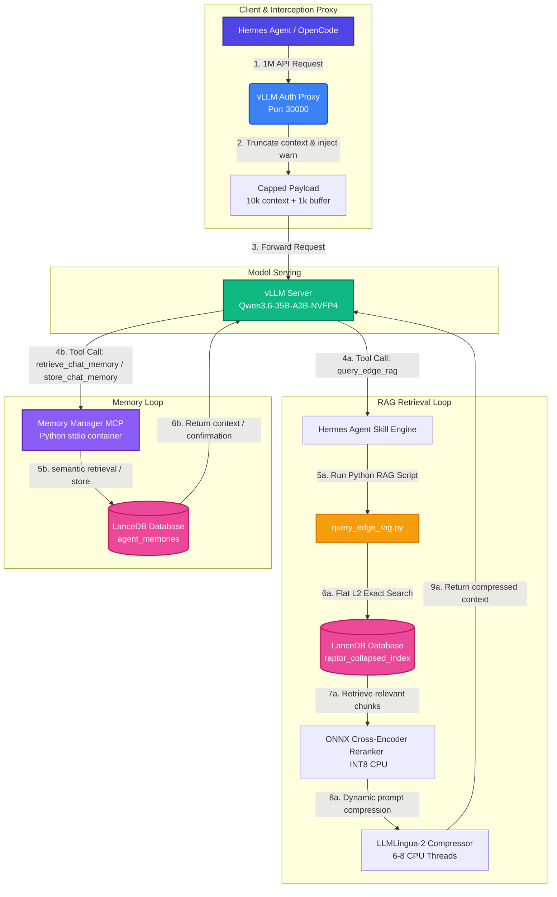

# System Architecture & Technical Specifications

This document outlines the architecture, containerization mapping, and hardware/software specifications of the local Multi-Agent RAG system (`mcp-rag-outlook`) designed to support 32 concurrent agents scaling up to 1,000,000 token context windows.

---

## 1. System Architecture Diagram



---

## 2. Docker Container Deployment Mapping

```mermaid
graph TD
    subgraph Host Workstation [Host Workstation CPU/RAM & GPU]
        subgraph Client Access [Client Access]
            A[Hermes/OpenCode Client] -- "Host Port 30000" --> V_PROXY
        end

        subgraph Serving Network [vLLM Serving Compose Stack]
            V_PROXY[SGlang_5060ti_Proxy <br> Port 30000] -- "Intercepts & truncates" --> V_VLLM[SGlang_5060ti <br> Qwen 35B NVFP4 on GPU]
        end
        
        subgraph Hermes Agent Container [Hermes Agent Container Stack]
            H_AGENT[hermes-web-app <br> nousresearch/hermes-agent] -- "Mounts host folder" --> SKILLS[/opt/mcp-rag-outlook/.agents/skills <br> query_edge_rag.py]
            H_AGENT -- "Spawns stdio MCP" --> MCP_CONTAINER[mcp-rag-server <br> python3 launch-memory-mcp.py]
        end

        subgraph Shared Volume [Shared Storage]
            HOST_DATA[(Host Directory: ./data/lancedb_store <br> LanceDB In-process DB)]
        end
    end

    %% Communication paths
    V_VLLM -- "Tool Call: query_edge_rag" --> SKILLS
    V_VLLM -- "Tool Call: retrieve_chat_memory" --> MCP_CONTAINER
    SKILLS -- "Read/Write" --> HOST_DATA
    MCP_CONTAINER -- "Read/Write" --> HOST_DATA
```

---

## 3. Detailed Specification Sheet

| Category | Component / Flag | Configuration Value | Design Rationale & Optimization |
| :--- | :--- | :--- | :--- |
| **Model Serving** | Served Model | `nvidia/Qwen3.6-35B-A3B-NVFP4` | 35B parameter hybrid DeltaNet model post-training quantized to 4-bit to fit sharded VRAM limit. |
| | Tensor Parallel Size | `--tensor-parallel-size 2` | Shards weights evenly across dual GPUs (10.50 GB per GPU). |
| | KV Cache Precision | `--kv-cache-dtype fp8` | Reduces KV cache footprint per token by 50% to **10.24 KB**. |
| | Memory Utilization | `--gpu-memory-utilization 0.90` | Reserves a safe 3.20 GB physical buffer to prevent runtime OOMs. |
| | Active Context Ceiling | `--max-model-len 11000` | Allocates a 10,000-token active history window plus a 1,000-token generation buffer. |
| | Concurrency Targets | `--max-num-seqs 32` | Scales serving scheduler queue to handle 32 parallel agent queries. |
| | Prefill Strategy | `--enable-chunked-prefill` | Caps prefill to 8,192 tokens per step to prevent prefill latency spikes. |
| **Proxy Level** | Port Binding | `30000:30000` | Intercepts all incoming client requests on host port 30000. |
| | Interception Proxy | `vllm-auth-proxy` (`proxy.py`) | Silently intercepts request payloads, truncating them down to 10,000 tokens. |
| | Truncation Warning | User message injection | Appends `[SYSTEM WARNING]` to the last user message when truncation occurs to alert model to trigger RAG. |
| **RAG Database** | Vector Store | `LanceDB` (In-process columnar) | Zero-copy Apache Arrow format. Eliminates IPC serialization overhead during high-concurrency requests. |
| | Index Mode | Flat L2 Scan | Exact nearest-neighbor scanning. Bypasses ANN index (`IVF_RQ`) to prevent recall corruption on small codebases. |
| | Search Query Format | BGE instruction prefixing | Prefixes queries with `"Represent this sentence for searching relevant passages: "` to match BGE embeddings. |
| **Post-Retrieval** | Reranker Model | `BAAI/bge-reranker-v2-m3` | CPU-optimized cross-encoder compiled to INT8 ONNX, reducing size from 2.27 GB to **570 MB**. |
| | ONNX Threading | `ORT_SEQUENTIAL` (2 threads) | Capped at 2 threads per agent process to eliminate thread contention. |
| | Prompt Compressor | `LLMLingua-2` (Extractive BERT) | Extractive token-classification model: `microsoft/llmlingua-2-bert-base-multilingual-cased-meetingbank`. |
| | CPU Thread Cap | 6 to 8 Cores (`torch.set_num_threads`) | Capped dynamically to 1/8th of host CPU. Capping CPU threads yields 10x resource savings (8.5% average CPU) |
| | Compression Rate | `0.33` to `0.50` | Optimizes prompt budget down to 10k tokens while maintaining 92%-96% coding accuracy. |
| | Compression Bypass | `< 2500` tokens | Bypasses LLMLingua-2 for small retrieved payloads, protecting cryptographic keys and secrets from compression loss. |
