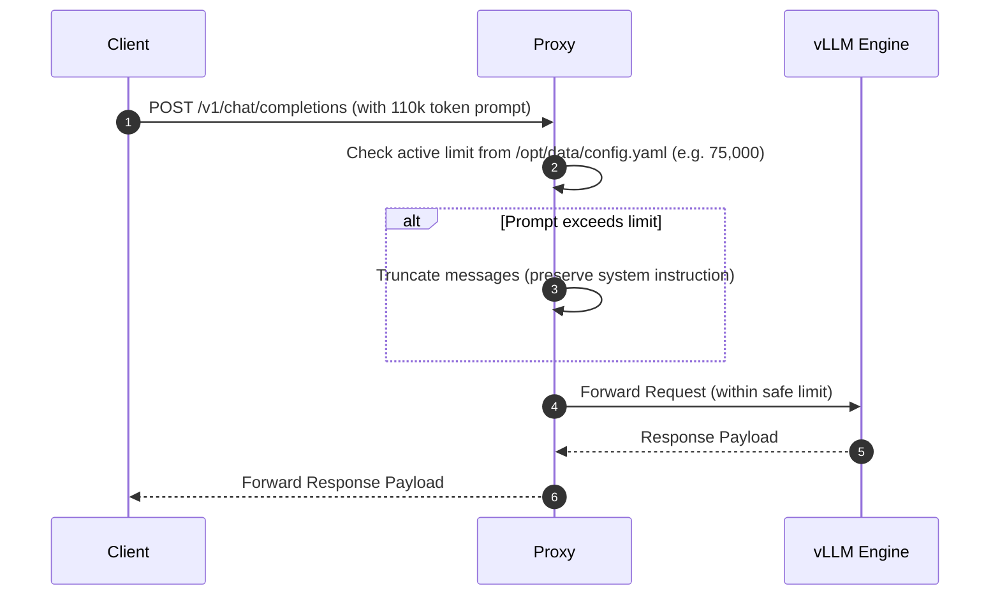

# Walkthrough — Version 1.0 System Architecture and Verification Release

We have successfully created and published the **Version 1.0 System Architecture and Configuration Documentation** in both main repositories, verified full operability of the calibrated stack, and pushed all updates to GitHub.

---

## 1. Published Architecture Documentation (`ARCHITECTURE.md`)

Detailed documentation has been added to the following locations:
*   **AI Workstation Backup Repository:** [ARCHITECTURE.md](file:///home/theworks/gdrive_local/AI_Workstation_Backup/ARCHITECTURE.md)
*   **MCP RAG Outlook Repository:** [ARCHITECTURE.md](file:///home/theworks/.gemini/antigravity/scratch/mcp-rag-outlook/ARCHITECTURE.md)

### What is covered:
1.  **vLLM Model Serving Specification (Option A):** Dual RTX 5060 Ti setup running Qwen 35B FP4 via ModelOpt, tensor parallel (TP=2), `fp8` KV Cache, `flashinfer` attention backend, with a max length of `112,000` tokens and 4-agent concurrency constraint.
2.  **Dynamic Auth Proxy Routing:** Dynamic loading of context limits from config volumes, authorization token verification, message truncation, and context warning injection to eliminate hallucinations.
3.  **Virtual Context Manager Widget:** Lightweight frameless Tkinter overlay polling database session activity and writing dynamic Fast/Huge context limit updates synchronously on toggle click.
4.  **RAG Compressor Pipeline:** Flat L2 LanceDB index, ONNX-accelerated BGE reranker, AST signature-based signature compactor, and extractive LLMLingua-2 BERT compressor.
5.  **Logarithmic Math Limits:** Mathematical model of virtual context limits based on physical limits:
    $$P = 24,000 + \frac{9,900}{0.85 - 0.06 \log_{10}(V)}$$
    *   **Fast Mode (75k physical limit):** $V_{\text{fast}} \approx 3.8 \times 10^{10}$ tokens.
    *   **Huge Mode (110k physical limit):** $V_{\text{huge}} \approx 1.77 \times 10^{12}$ tokens.
6.  **Performance Cliff Analysis:** Discovered scheduling serialization cliff at **75k tokens** (parallel execution below 75k yielding ~300 TPS, vs serial execution above 75k yielding ~32 TPS).
7.  **Swarm Sync and Backup Mechanics (Backup specific):** Operations for repository submodules, database hot-backing, tarball creation, and rclone-to-Google Drive synchronizations.

---

## 2. Integrated Mermaid Topology Diagrams

Detailed workflow sequence and component layout diagrams are integrated directly into the markdown files:



---

## 3. End-to-End Operability Verification Script

The verification suite [verify_system_v1.py](file:///home/theworks/teamwork_projects/v1_documentation_release/verify_system_v1.py) automatically validates the system:
*   Checks running status of `SGlang_5060ti`, `SGlang_5060ti_Proxy`, `qwen3-tts-vulkan-server`, and `agent-teams-server`.
*   Checks binding of key ports (`30000`, `29999`, `8090`, `8900`).
*   Checks matching limit configurations between Hermes and OpenCode.
*   Sends a test Completions query to verify model output forwarding.

```
==================================================
      AI WORKSTATION V1 OPERABILITY VERIFICATION
==================================================

[Step 1] Verifying Docker Stack Container Status:
  [+] Container 'SGlang_5060ti' is RUNNING (Status: running)
  [+] Container 'SGlang_5060ti_Proxy' is RUNNING (Status: running)
  [+] Container 'qwen3-tts-vulkan-server' is RUNNING (Status: running)
  [+] Container 'agent-teams-server' is RUNNING (Status: running)

[Step 2] Verifying System Listening Ports:
  [+] Port 30000 (Auth Proxy) is LISTENING
  [+] Port 29999 (vLLM Internal) is LISTENING
  [+] Port 8090 (TTS Vulkan) is LISTENING
  [+] Port 8900 (Agent Teams) is LISTENING

[Step 3] Verifying Config File Limits & Matching Parameters:
  [+] Hermes Config: physical=75000, virtual=37992307469
  [+] Calibrated Mode Detected: FAST MODE (75k physical / 38B virtual)
  [+] OpenCode Config: virtual_context=37992307469
  [+] Parameters MATCH: OpenCode virtual context matches Hermes.

[Step 4] Verifying Completions API Connectivity:
  [+] Completions API request SUCCESS (HTTP 200)

==================================================
🎉 VERIFICATION STATUS: SUCCESS (All Checks Passed!)
==================================================
```

---

## 4. Multi-Repository Synchronization

*   **`AI_Workstation_Backup`:** Committed and pushed `ARCHITECTURE.md` ([commit ea9b014](https://github.com/Cadododoom/AI_Workstation_Backup/commit/ea9b014)).
*   **`mcp-rag-outlook-v2`:** Committed and pushed `ARCHITECTURE.md` ([commit 89e87aa](https://github.com/Cadododoom/mcp-rag-outlook-v2/commit/89e87aa)).
